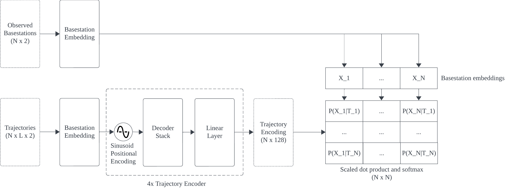
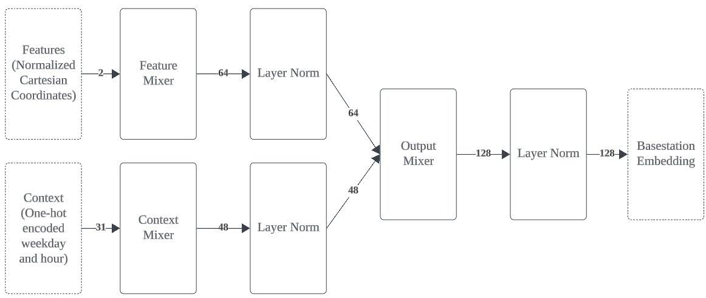

# Motivation

The objective function of the Hungarian algorithm in Trajectory Recovery from Ash can be interpreted as a maximum likelihood objective.

We replace the cost matrix of the objective function as the negative log-likelihood predicted by a neural network.

# Architecture

Since a sequence of basestations is a discrete sequence similar to language modeling and the transformer architecture is well studied, we use the transformer architecture to model `Pr(x[t] | x[0, ...,t-1])`.

But different from language modeling, we are met with an additional constraints in which the available pool of tokens varies at different time steps. For example, in a 2 users scenario: user 1 travel from base station `A` to base station `B` while user 2 stayed at `C`; this lead to the set of observed tokens changes from `{A, C}` to `{B, C}`.

We require the predicted probability distribution of tokens to be consistent with the observation at all time (i.e. `Pr(A) = 0` at the next time step). Hence, we adapted the non-parametric image classification architecture in [CLIP](https://arxiv.org/abs/2103.00020). Additional benefits of using a non-parametric architecture are: 1) no need to re-train model on addition/removal of basestations; 2) likelihood can be approximated using k-nearest neighbors during inference.

We adapted the encoder of [RAoPT](https://arxiv.org/abs/2210.09375) and added layer norms after each mixer block. The feature mixer takes spatial coordinates of a token (2-dimensional) as input, while the context mixer takes a concatenation of the one-hot encoded hour (24-dimensional) and the one-hot encoded week day (7 dimensional) as input.

The reason of using MLP for embedding instead of learned embedding is spatial locality. We want near basestations to have similar embeddings.

# Feature pre-processing

In addition to the dataset pre-processing described in `data_preprocess`, we do the following:

1. Cartesian coversion

Same as [RaOPT](https://arxiv.org/abs/2210.09375), we convert lat-long to Cartesian coordinates by projection to the tangent plane of the globe at the reference point. We use the median of latitude and longitude of the clusters.

2. Normalization

Cartesian coordinates are normalized to `[-1, +1]`.

# Ideas for improvement

## Computational complexity

Inference cost of the transformer architecture is O(n * L^2) with cache, where n = no. of trajectories, L = sequence length. Time complexity can be reduced by using linear time architectures, e.g. [Mamba](https://arxiv.org/abs/2312.00752).

## Sparse networks / Multi-task learning

Our base station embedding architecture can be reformulated as multi-task learning where the model needs to make likelihood predictions given a task context. The task context is then used to select a sub-network for inference similar to [Active Dendrites](https://arxiv.org/abs/2201.00042) or [Multi-Head Mixture-of-Experts](https://arxiv.org/abs/2404.15045).